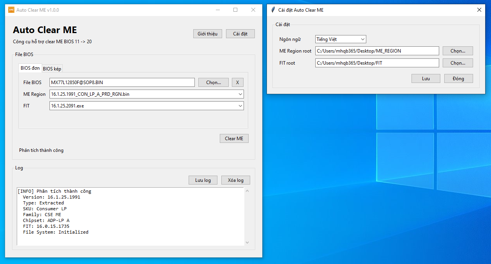

# Auto Clear ME



## English

English | [Tiếng Việt](#tiếng-việt)

A tool to help clear Intel ME/CSME/TXE BIOS

The app uses ME Analyzer to analyze the selected BIOS dump, then suggests a matching ME Region and Flash Image Tool (FIT) version. The cleaned BIOS file is saved with the `_CLEARME` suffix, and the original BIOS dump is never modified or overwritten

### Features

- Supports Intel ME/CSME/TXE firmware, including legacy ME 10 and older when a matching ME Region file is available
- Uses direct legacy ME/TXE injection for ME 10 and older, without requiring FIT auto-build
- Automatically analyzes BIOS dumps with ME Analyzer
- Suggests matching ME Region and FIT versions
- Automatically tries the remaining compatible FIT versions if the first one fails
- Supports both Single BIOS and Dual BIOS workflows
- Saves the cleaned BIOS next to the original input file with the `_CLEARME` suffix
- Merges two BIOS files in selected order and trims trailing dump metadata automatically
- Splits a merged BIOS image by user-entered BIOS 1 and BIOS 2 sizes
- Finds MSDM/plaintext Windows product keys, shows their start/end offsets, and patches a new key into BIOS
- Finds, exports, and imports whole DMI blocks for Acer, ASUS, Dell, HP, and Lenovo
- Supports vendor BIOS password unlock helpers for Acer, ASUS, HP, and Dell 8FC8/CF1B
- Dell 8FC8/CF1B unlock can also patch supported dumps to allow Service Tag re-entry
- Extracts Dell PFS/PKG/TXT/RCV update images
- Uses a compact grouped function menu and a resizable control/log layout
- Opens File Explorer after a successful clear
- Supports English and Vietnamese UI
- The release ZIP includes portable Python and required ME Analyzer dependencies
- Automatically checks for updates when a new release is available

ME Region and FIT are not distributed with this project. You must prepare them yourself, or download what I have here: [ME Region & FIT](https://drive.google.com/drive/folders/1ocp61oICeFGZuf-J59gpnLO88XGzKvPY?usp=sharing)

### Contributing

Contribute ideas, new ME & FIT versions or report issues at [Laptop Repair Sharing](https://t.me/LaptopRepairSharing)

### Download And Run

You need Python 3.10 or newer to run the app. If you don't have it, download Python from [python.org](https://www.python.org/downloads/)

1. Open the [GitHub Releases](https://github.com/mhqb365/AutoClearME/releases)
2. Download the ZIP file from the latest release
3. Extract the ZIP file to any folder
4. Double-click `AutoClearME.exe` if the release includes it, or double-click `Run.bat`
5. The Auto Clear ME interface will open

To build the Windows exe yourself, double-click `BuildExe.bat`. The output will be created at `dist\AutoClearME\AutoClearME.exe`.

### How To Use

1. Open `Settings`
2. Select the FIT folder in `FIT root`
3. Select the ME Region folder in `ME Region root`
4. Select a BIOS file
5. Wait until `Analyze success` appears
6. Review or change the suggested `ME Region` and `FIT`
7. Click `Clear ME`

### MEA Log Field Meanings

- `BIOS Vendor`: The BIOS or motherboard manufacturer, such as ASUS, Dell, or HP
- `BIOS Version`: The system BIOS version
- `Family`: The Intel management firmware family. `CSE ME` means Intel Converged Security and Management Engine
- `Version`: The ME firmware version stored in the BIOS
- `Release`: The release state. `Production` is an official release; `Pre-Production` is generally a test build
- `Type`: The firmware type. `Extracted` is usually an ME region extracted from a machine BIOS; `Region` is clean firmware used as a source
- `SKU`: The firmware feature variant. For example, `Consumer LP` targets consumer low-power platforms
- `Chipset`: The chipset and stepping for which the firmware is configured
- `Chipset Support`: The chipset family supported by the firmware. For example, `CNP` means Cannon Point
- `TCB SVN`: The Trusted Computing Base security version used to prevent downgrade to firmware with a lower security level
- `VCN`: Version Control Number, used to control firmware compatibility and downgrade behavior
- `Production Ready`: Whether the firmware is marked as ready for use on production systems
- `Workstation Support`: Whether workstation-specific configuration or features are enabled
- `OEM Configuration`: Whether the firmware contains configuration specific to the system manufacturer
- `Date`: The date on which the ME firmware was built or released
- `Size`: The ME firmware region size converted to MB. For example, `2.49 MB`
- `FIT`: The Flash Image Tool version used to build or configure the firmware
- `File System`: The state of the internal ME file system
  - `Initialized`: Initialized but not fully configured for the system
  - `Configured`: Configuration has been completed
  - `Unconfigured`: Configuration has not been completed
  - `Corrupted`: The internal data may be damaged
- `MEA Database Name`: The matching firmware name in the ME Analyzer database
- `MEA Support Status`: Whether the current ME Analyzer version recognizes and supports the firmware
- `RSA Signature Hash`: The RSA signature hash used to verify firmware integrity and origin

Single BIOS output:

```text
INPUT_CLEARME.bin
```

Dual BIOS output:

```text
FILE1_CLEARME.bin
FILE2_CLEARME.bin
```

The cleaned file is saved in the same folder as the input file. After a successful clear, File Explorer opens the folder that contains the result

### Updates

When the app opens, it checks the latest GitHub Release

If a newer version is available, the app asks before updating. If the user agrees, Auto Clear ME will:

1. Download the release ZIP file from GitHub
2. Extract it to a temporary folder
3. Replace the portable app files
4. Keep the user's local `config.json`
5. Reopen the app, preferring `AutoClearME.exe` when it is included and falling back to `Run.bat`

### Notes & Safety

- Always keep an untouched backup of the original BIOS dump
- Use a compatible FIT version
- If FIT fails, find the correct FIT version and place it inside the FIT folder
- Do not flash if FIT reports a build error
- Do not flash if ME Analyzer reports unexpected firmware information

### License

MIT

## Tiếng Việt

[English](#english) | Tiếng Việt

Công cụ hỗ trợ clear Intel ME/CSME/TXE BIOS

App dùng ME Analyzer để phân tích BIOS dump đã chọn, đề xuất ME Region và Flash Image Tool (FIT) phù hợp. BIOS đã clear có hậu tố `_CLEARME`, BIOS dump gốc không bị chỉnh sửa hoặc ghi đè

### Tính Năng

- Hỗ trợ Intel ME/CSME/TXE, bao gồm ME 10 trở về trước khi có đủ ME Region phù hợp
- Dùng legacy ME/TXE inject trực tiếp cho ME 10 trở về trước, không cần FIT auto-build
- Tự động phân tích BIOS dump bằng ME Analyzer
- Đề xuất ME Region và FIT phù hợp
- Tự động thử các bản FIT phù hợp còn lại nếu bản đầu tiên thất bại
- Hỗ trợ Single BIOS và Dual BIOS
- Lưu file BIOS đã clear ngay cạnh file input gốc với hậu tố `_CLEARME`
- Ghép 2 file BIOS theo đúng thứ tự chọn và tự trim metadata dư ở cuối dump
- Tách file BIOS đã ghép theo size BIOS 1 và BIOS 2 do người dùng nhập
- Tìm Windows product key dạng plaintext, hiển thị offset bắt đầu/kết thúc và sửa key mới vào BIOS
- Tìm, xuất và nhập nguyên khối DMI cho Acer, ASUS, Dell, HP và Lenovo
- Hỗ trợ mở khóa BIOS cho Acer, ASUS, HP và Dell 8FC8/CF1B
- Dell 8FC8/CF1B có thể patch một số dump để nhập lại Service Tag
- Trích xuất Dell PFS/PKG/TXT/RCV update image
- Giao diện dùng menu chức năng gom theo hãng và có thể kéo chỉnh chiều cao control/log
- Mở File Explorer sau khi clear thành công
- Hỗ trợ giao diện tiếng Anh và tiếng Việt
- File ZIP release đã bao gồm Python portable và thư viện ME Analyzer cần thiết
- Tự động kiểm tra cập nhật khi có bản phát hành mới

ME Region và FIT không được phân phối kèm dự án này. Bạn tự chuẩn bị hoặc tải những gì tôi có ở đây: [ME Region & FIT](https://drive.google.com/drive/folders/1ocp61oICeFGZuf-J59gpnLO88XGzKvPY?usp=sharing)

### Đóng góp

Đóng góp ý kiến, đóng góp ME & FIT mới hoặc báo lỗi tại [Laptop Repair Sharing](https://t.me/LaptopRepairSharing)

### Tải Về Và Chạy App

Bạn cần có Python 3.10 hoặc mới hơn để chạy app. Nếu chưa có, tải Python tại [python.org](https://www.python.org/downloads/)

1. Mở trang [GitHub Releases](https://github.com/mhqb365/AutoClearME/releases)
2. Tải file ZIP của bản release mới nhất
3. Giải nén file ZIP ra một thư mục bất kỳ
4. Nhấp đúp vào `AutoClearME.exe` nếu bản release có sẵn, hoặc nhấp đúp vào `Run.bat`
5. Giao diện Auto Clear ME sẽ được mở lên

Để tự build file exe trên Windows, nhấp đúp vào `BuildExe.bat`. Output sẽ nằm ở `dist\AutoClearME\AutoClearME.exe`.

### Cách Dùng

1. Mở `Settings`
2. Chọn nơi chứa FIT trong ô `FIT root`
3. Chọn nơi chứa ME Region trong ô `ME Region root`
4. Chọn file BIOS
5. Chờ đến khi hiện `Analyze success`
6. Kiểm tra hoặc chọn lại `ME Region` và `FIT` được đề xuất
7. Bấm `Clear ME`

### Ý Nghĩa MEA Log

- `BIOS Vendor`: Hãng sản xuất BIOS hoặc bo mạch, ví dụ ASUS, Dell hoặc HP
- `BIOS Version`: Phiên bản BIOS hệ thống
- `Family`: Dòng firmware quản lý của Intel. `CSE ME` là Intel Converged Security and Management Engine
- `Version`: Phiên bản firmware ME đang nằm trong BIOS
- `Release`: Trạng thái phát hành. `Production` là bản chính thức; `Pre-Production` thường là bản thử nghiệm
- `Type`: Kiểu firmware. `Extracted` thường là vùng ME trích từ BIOS máy; `Region` là firmware sạch dùng làm nguồn
- `SKU`: Biến thể và nhóm tính năng. Ví dụ `Consumer LP` là bản dành cho máy tiêu dùng trên nền tảng tiết kiệm điện
- `Chipset`: Chipset và stepping mà firmware đang được cấu hình để sử dụng
- `Chipset Support`: Họ chipset được firmware hỗ trợ, ví dụ `CNP` là Cannon Point
- `TCB SVN`: Mức phiên bản bảo mật của Trusted Computing Base, được dùng để kiểm soát việc hạ cấp xuống firmware có mức bảo mật thấp hơn
- `VCN`: Version Control Number, số kiểm soát khả năng tương thích và hạ cấp firmware
- `Production Ready`: Cho biết firmware đã được đánh dấu sẵn sàng sử dụng trên máy thương mại hay chưa
- `Workstation Support`: Cho biết firmware có bật cấu hình hoặc tính năng dành cho máy trạm hay không
- `OEM Configuration`: Cho biết firmware có chứa cấu hình riêng của hãng sản xuất máy hay không
- `Date`: Ngày firmware ME được tạo hoặc phát hành
- `Size`: Kích thước vùng firmware ME được quy đổi sang MB. Ví dụ `2.49 MB`
- `FIT`: Phiên bản Flash Image Tool đã dùng để tạo hoặc cấu hình firmware
- `File System`: Trạng thái hệ thống tệp nội bộ của ME
  - `Initialized`: Đã khởi tạo nhưng chưa hoàn tất cấu hình cho máy
  - `Configured`: Đã được cấu hình
  - `Unconfigured`: Chưa được cấu hình
  - `Corrupted`: Có dấu hiệu hỏng dữ liệu
- `MEA Database Name`: Tên firmware tương ứng trong cơ sở dữ liệu của ME Analyzer
- `MEA Support Status`: Cho biết bản ME Analyzer hiện tại có nhận diện và hỗ trợ firmware này hay không
- `RSA Signature Hash`: Hash của chữ ký RSA dùng để xác minh tính toàn vẹn và nguồn gốc firmware

Kết quả Single BIOS:

```text
INPUT_CLEARME.bin
```

Kết quả Dual BIOS:

```text
FILE1_CLEARME.bin
FILE2_CLEARME.bin
```

File sau khi clear sẽ được lưu ngay trong thư mục của file input. Khi clear thành công, File Explorer sẽ tự mở thư mục chứa file kết quả

### Cập Nhật

Khi mở app, app sẽ kiểm tra GitHub Release mới nhất

Nếu có bản mới, app sẽ hỏi trước khi cập nhật. Nếu người dùng đồng ý, Auto Clear ME sẽ:

1. Tải file ZIP release từ GitHub
2. Giải nén vào thư mục tạm
3. Thay thế các file app portable
4. Giữ lại `config.json` trên máy người dùng
5. Chạy lại `Run.bat` để mở app lên lại

### Lưu Ý & An Toàn

- Luôn giữ nguyên bản sao BIOS dump gốc
- Dùng bản FIT phù hợp
- FIT lỗi thì tìm FIT đúng phiên bản bỏ vào folder chứa FIT
- Không flash nếu FIT báo lỗi khi build
- Không flash nếu ME Analyzer báo thông tin firmware bất thường

### License

MIT
